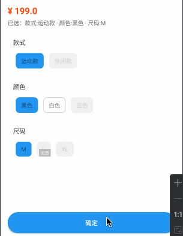

# sku-engine-android

Android SKU 选择引擎示例



本项目演示：

- SKU 规格选择 UI 实现
- 规格状态动态计算（可选 / 不可选 / 售罄 / 已选）
- ViewModel + StateFlow 状态驱动
- SkuEngine 选择引擎设计

---

## ✨ 功能效果

- 支持多规格组合选择
- 实时状态联动（无需网络请求）
- 自动匹配 SKU 结果

---

## 🧠 核心设计

本项目核心是一个独立的选择引擎：

```
SkuEngine
```

职责：

- 输入：specList + skuList
- 输出：SpecResult + SkuResult
- 负责所有 SKU 状态计算逻辑

👉 ViewModel 只负责状态流转，不参与计算

---

## 📚 相关设计文章

建议按顺序阅读：

* [（一）SKU 建模（笛卡尔积）](https://github.com/yuncodelab/sku-system-design/docs/part1.md)
* [（二）服务端建模与接口设计](https://github.com/yuncodelab/sku-system-design/docs/part2.md)
* [（三）Android SKU 选择引擎实现](https://github.com/yuncodelab/sku-system-design/docs/part3.md)（⭐
  本项目对应）

---

## ⚠️ 设计边界

本项目聚焦 SKU 选择逻辑，未包含：

- SKU 图片联动
- 多价格体系（会员价 / 活动价）
- 复杂库存策略

---

## 🔗 相关项目

- [sku-engine-java](https://github.com/yuncodelab/sku-engine-java)（服务端数据建模）